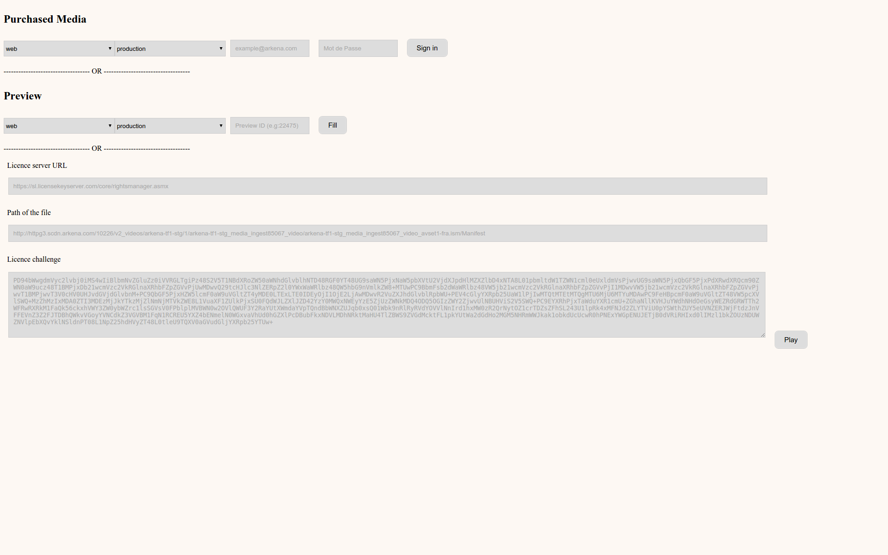

OSM Test Player
-----------
The OSM Test Player is a tool who can be used to test a Playready Smooth video on a Silverlight player

USAGE
---------

### Purchased Media

If you wanna test a media that you did purchased you can log to your account then you'll see then the list of the media you did purchased.
Select the movie you wanna read then click on Fill.

### Media preview

If you wanna test a preview just enter his Media ID then click on Fill.

### Playe the Media

You have to fill the 3 fields with one of the 2 methods below or manually.
When the 3 fields are filled click on Play to launch your video.
If it's infinitely spinning u did a mistake.
